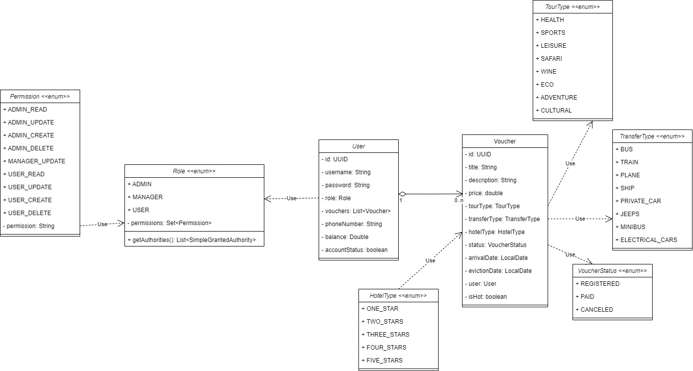

# Travel agency. Spring Boot + Thymeleaf Project

## Description

The class diagram of the Domain model is shown in the figure below:

# GENERAL DESCRIPTION OF THE PROJECT

## PRECONDITION
All key functionalities are implemented according to the project goals. Manual testing and unit testing were successfully conducted. CI/CD pipelines ensure automated build and deployment.

## CORE IMPLEMENTATION

A full-stack web application has been developed using Spring Boot for the backend and Thymeleaf for the frontend, featuring:

### Used Technologies
- **Spring Data JPA** — ORM for database interaction.
- **Spring Security** — authentication and authorization framework.
- **DTOs (Data Transfer Objects)** — separation of entity and transport layers.
- **SQL Scripts** — database initialization and versioning using Flyway.

### Implemented Functionalities
- **UI Internationalization** — English and Ukrainian languages fully supported.
- **Data Validation** — enforced at DTO and entity levels using javax.validation.
- **Exception Handling** — global handler implemented via `@ControllerAdvice`.
- **Database Configuration** — PostgreSQL configured via Flyway migration.
- **Unit Testing (Services)** — critical business logic covered with JUnit and Mockito.
- **Logging** — key business actions, security events, and error handling logged using SLF4J + AOP.
- **Order (Voucher) Management** — users can view, book, pay, and cancel vouchers.
- **JWT Authentication** — access and refresh token mechanism implemented for stateless security.

## USER FUNCTIONALITY

- **User Registration and Login** — via database-backed authentication or OAuth2 (Google).
- **User Role Management** — roles include USER, MANAGER, and ADMIN.
- **Profile Management** — users can view and update their profile information.
- **Voucher Catalog** — users can browse available vouchers with pagination, sorting, and filtering.
- **Voucher Booking** — users can book a voucher and track the status (e.g., Booked, Paid, Cancelled).
- **Voucher Review** — after using a voucher, users can leave reviews and ratings.
- **Manager Dashboard** — managers can view user orders, update voucher statuses.
- **Admin Panel** — admins manage users, roles, and voucher catalog entries.

## NICE TO HAVE FEATURES (Implemented)

- **Searching, Pagination, and Sorting** — in voucher listings.
- **Stateless Authentication (JWT)** — using access and refresh tokens.
- **OAuth2 Authentication** — login via Google OAuth2 provider.
- **Password Hashing** — implemented with `BCryptPasswordEncoder`.
- **Role-Based Access Control** — method-level and URL-level authorization with custom rules.
- **Unit Testing (Controllers)** — basic testing coverage for REST endpoints.
- **CI/CD Pipelines** — automated build and deployment using GitHub Actions (planned integration with production server).

## TOOLS & TECHNOLOGIES USED

- **Lombok** — simplifies boilerplate code.
- **ModelMapper** — DTO mapping from entities.
- **Aspect-Oriented Programming (AOP)** — logging implementation.
- **Thymeleaf** — server-side template engine for UI rendering.
- **Flyway** — database version control and migrations.
- **JWT (JSON Web Tokens)** — stateless authentication system.
- **OAuth2** — external authentication support (Google).
- **GitHub Actions** — used for continuous integration and delivery setup.

## SPRING SECURITY IMPLEMENTATION DETAILS

### Authentication Strategies
- **Database-backed Authentication** — via Spring Security and JPA repository.
- **OAuth2 Authentication** — using Google account integration.

### Authorization & Access Control
- **Role-Based Access Control (RBAC)** — roles: USER, MANAGER, ADMIN.
- **Method-Level Security** — `@PreAuthorize`, `@Secured` annotations.
- **URL-Based Security** — access control policies defined in `SecurityFilterChain`.

### Password Security
- **BCrypt Password Hashing** — all passwords stored securely.
- **Password Reset** — planned for future implementation via email recovery.

### Session & Token Management
- **Stateless Authentication** — access and refresh token model with JWTs.
- **Refresh Token Flow** — allows token renewal without full reauthentication.

### Security Best Practices
- **CSRF Protection** — disabled for REST APIs.
- **Error Handling** — no detailed error messages exposed to clients.
- **Brute-force Attack Mitigation** — login attempt limiting planned.
- **HTTPS Usage** — recommended for production deployment.

## CURRENT LIMITATIONS AND FUTURE IMPROVEMENTS
- OAuth2 supports only Google login for now.
- Password reset functionality is in planning.
- No brute-force protection yet (future security hardening planned).
- CI/CD pipeline configured for development; production deployment pipeline in progress.
